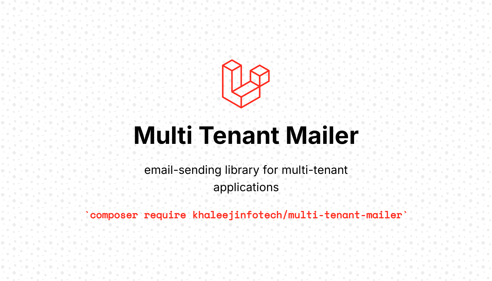

# Multi Tenant Mailer




The `MultiTenantMailer` is a powerful and flexible email-sending library designed for multi-tenant applications. It simplifies the process
of configuring and sending emails while supporting multiple tenants with different settings.

## Features

- Support for multiple tenants with unique SMTP configurations.
- Easy-to-use API for setting up email properties (host, port, username, etc.).
- Ability to queue emails for background processing.
- Support for HTML and plain text emails.

## Installation

1. **Install via Composer**:
   If you haven't done so, install the package using Composer:

   ```bash
   composer require khaleejinfotech/multi-tenant-mailer
   ```

2. **Register the service provider**:
   Open your `config/app.php` file and add the service provider to the `providers` array.

   ```php
   'providers' => [
       // ...
       Khaleejinfotech\MultiTenantMailer\MultiTenantMailerServiceProvider::class,
   ],

3. **Publish Configuration:** After installation, publish the configuration file and any required resources:
    ```bash
    php artisan vendor:publish --provider="Khaleejinfotech\MultiTenantMailer\MultiTenantMailerServiceProvider" 
    ```

## Configuration

You can configure the queue_class in the published configuration file (config/multi-tenant-mailer.php) like this:

```php
return [
    'queue_class' => \Khaleejinfotech\MultiTenantMailer\Jobs\MultiTenantMailerQueued::class,
];
```

## Usage

### MultiTenantMailer

#### Initialize the Mailer

```php
use Khaleejinfotech\MultiTenantMailer\MultiTenantMailer;

$mailer = new MultiTenantMailer();
$mailer->init($host, $port, $username, $password, $encryption);
```

#### Set Email Properties

```php
$mailer->setFrom($fromAddresses, $fromName)
  ->setTo($toAddresses, $toName)
  ->setSubject($subject)
  ->setBody($body)
  ->setContentType('text/html')
  ->setAttachments($attachments)
  ->shouldQueue(); // Optional: Set to true if you want to queue the email
```

#### Send the Email

```php
$mailer->send();
```

### MultiTenantMailerSettings

#### Create and Configure Settings

```php
use Khaleejinfotech\MultiTenantMailer\Contracts\MultiTenantMailerSettings;

$mailerSettings = new MultiTenantMailerSettings();
$mailerSettings->setHost($host)
   ->setPort($port)
   ->setUsername($username)
   ->setPassword($password)
   ->setEncryption($encryption)
   ->setFromAddress($fromAddress, $fromName);
```

by this you can directly pass the settings object to the mailer instance. <br/>
Here is the example

```php
use Khaleejinfotech\MultiTenantMailer\MultiTenantMailer;

$mailer = new MultiTenantMailer();
$mailer->withSettings($mailerSettings);
```

## Using Facades

If you prefer to use facades for cleaner syntax, you can utilize the facades you've created.

### Using MultiTenantMailer Facade

```php
use Khaleejinfotech\MultiTenantMailer\Facades\MultiTenantMailer;

MultiTenantMailer::init($host, $port, $username, $password, $encryption)
  ->setFrom($fromAddresses, $fromName)
  ->setTo($toAddresses, $toName)
  ->setSubject($subject)
  ->setBody($body)
  ->setContentType('text/html')
  ->setAttachments($attachments)
  ->shouldQueue()
  ->send();
```

### Using MultiTenantMailerSettings Facade

```php
use Khaleejinfotech\MultiTenantMailer\Facades\MultiTenantMailerSettings;

MultiTenantMailerSettings::setHost($host)
  ->setPort($port)
  ->setUsername($username)
  ->setPassword($password)
  ->setEncryption($encryption)
  ->setFromAddress($fromAddress, $fromName);
```

## Notification Driver Support

```php
public function via(object $notifiable): array
{
    return ['tenant_mailer'];
}

public function toTenantMailer($notifiable): MultiTenantMailer
{
    return (new MultiTenantMailer)
        ->setHost(config('mail.mailers.smtp.host'))
        ->setPort(config('mail.mailers.smtp.port'))
        ->setUsername(config('mail.mailers.smtp.username'))
        ->setPassword(config('mail.mailers.smtp.password'))
        ->setEncryption(config('mail.mailers.smtp.encryption'))
        ->setFrom(config('mail.from.address'))
        ->setTo($notifiable)
        ->setSubject('Subject')
        ->setBody($this->toMail($notifiable)->render());
}
```

the `setBody()` can have either Notification/Mailable or the self mailable method to render the message; <br/>

#### 1. Notification/Mailable Object

```php
->setBody(new MailTestMessge()); 
```

#### 2. Self `$this->toMail($notifiable)->render()` method

```php
->setBody($this->toMail($notifiable)->render()); 
```

## Queues

The `MultiTenantMailer` class provides the ability to define specific queues for processing emails, giving you control over how and when
emails are queued.

### Setting the Queue

You can set a queue name or identifier using the `setOnQueue` method. This allows you to specify a queue that suits your system’s
job-handling
requirements.

```php
->setOnQueue('emails'); 
```

## Events

The library includes the following events:

`MailFailed:` Triggered when sending an email fails. <br/>

`MailSuccess:` Triggered when an email is sent successfully.

## Available Methods

### Class MultiTenantMailer

| Method                                                                                  | Summary                                                            |
|-----------------------------------------------------------------------------------------|--------------------------------------------------------------------|
| `init(string $host, int $port, string $username, string $password, string $encryption)` | Initializes mailer settings.                                       |
| `withSettings(MultiTenantMailerSettings $mailerSettings)`                               | Sets mailer settings from a `MultiTenantMailerSettings` instance.  |
| `setHost(string $host)`                                                                 | Sets the mail server host.                                         |
| `getHost(): string`                                                                     | Retrieves the mail server host.                                    |
| `setPort(int $port)`                                                                    | Sets the mail server port.                                         |
| `getPort(): int`                                                                        | Retrieves the mail server port.                                    |
| `setUsername(string $username)`                                                         | Sets the username for the mail server.                             |
| `getUsername(): string`                                                                 | Retrieves the username for the mail server.                        |
| `setPassword(string $password)`                                                         | Sets the password for the mail server.                             |
| `getPassword(): string`                                                                 | Retrieves the password for the mail server.                        |
| `setEncryption(string $encryption)`                                                     | Sets the encryption type (e.g., 'tls', 'ssl').                     |
| `getEncryption(): string`                                                               | Retrieves the encryption type.                                     |
| `setTo(array\|string $addresses, string $name = null)`                                  | Sets the recipient's email address(es) and optional name.          |
| `getToAddresses(): array\|string`                                                       | Retrieves the recipient's email address(es).                       |
| `getToName(): ?string`                                                                  | Retrieves the name of the recipient.                               |
| `setCc(array $addresses)`                                                               | Sets the cc recipient's email address(es) .                        |
| `getCcAddresses(): array`                                                               | Retrieves the cc recipient's email address(es).                    |
| `setBcc(array $addresses)`                                                              | Sets the bcc recipient's email address(es) .                       |
| `getBccAddresses(): array`                                                              | Retrieves the bcc recipient's email address(es).                   |
| `setFrom(array\|string $addresses, string $name = null)`                                | Sets the sender's email address(es) and optional name.             |
| `getFromAddresses(): array\|string`                                                     | Retrieves the sender's email address(es).                          |
| `getFromName(): ?string`                                                                | Retrieves the name of the sender.                                  |
| `setSubject(string $subject)`                                                           | Sets the email subject.                                            |
| `setContentType(string $contentType = 'text/html')`                                     | Sets the content type (e.g., 'text/html').                         |
| `shouldQueue()`                                                                         | Marks the email to be queued for sending.                          |
| `isShouldQueue(): bool`                                                                 | Checks if the email should be queued.                              |
| `onQueue(BackedEnum\|string\|null $onQueue = 'default')`                                | Sets the job queue name.                                           |
| `getQueue(): BackedEnum\|string\|null $onQueue`                                         | Retrieves the job queue name.                                      |
| `getStreamOptions(): null\|array`                                                       | Get the stream options.                                            |
| `setStreamOptions(): null\|array`                                                       | Set the stream options.                                            |
| `setBody(Notification\|string $notification)`                                           | Sets the email body, either from a notification or a plain string. |
| `getBody(): string`                                                                     | Retrieves the email body.                                          |
| `setBodyPart(string $bodyPart): void`                                                   | Sets the plain text body part of the email.                        |
| `getBodyPart(): string`                                                                 | Retrieves the plain text body part of the email.                   |
| `setAttachments(array $attachments): void`                                              | Sets attachments for the email.                                    |
| `getAttachments(): array`                                                               | Retrieves the attachments for the email.                           |
| `setHeaders(array $headers): void`                                                      | Sets headers for the email.                                        |
| `getHeaders(): array`                                                                   | Retrieves the headers for the email.                               |
| `useFallbackConfig()`                                                                   | Sets default email settings if there is no email config set.       |
| `send(): int`                                                                           | Sends the email and returns the number of emails sent.             |

### Class MultiTenantMailerSettings

| Method                                                   | Summary                                                            |
|----------------------------------------------------------|--------------------------------------------------------------------|
| `setHost(string $host)`                                  | Sets the mail server host for the settings.                        |
| `getHost(): string`                                      | Retrieves the mail server host from the settings.                  |
| `setPort(int $port)`                                     | Sets the mail server port for the settings.                        |
| `getPort(): int`                                         | Retrieves the mail server port from the settings.                  |
| `setUsername(string $username)`                          | Sets the username for the mail server in the settings.             |
| `getUsername(): string`                                  | Retrieves the username for the mail server from the settings.      |
| `setPassword(string $password)`                          | Sets the password for the mail server in the settings.             |
| `getPassword(): string`                                  | Retrieves the password for the mail server from the settings.      |
| `setEncryption(string $encryption)`                      | Sets the encryption type (e.g., 'tls', 'ssl') in the settings.     |
| `getEncryption(): string`                                | Retrieves the encryption type from the settings.                   |
| `setFromName(string $name = null)`                       | Sets the sender's name in the settings.                            |
| `getFromName(): ?string`                                 | Retrieves the sender's name from the settings.                     |
| `setFromAddress(string $addresses, string $name = null)` | Sets the sender's email address and optional name in the settings. |
| `getFromAddress(): ?string`                              | Retrieves the sender's email address from the settings.            |

## Exception Handling

The MultiTenantMailer class throws MultiTenantMailerException when the required properties (host, port, username, etc.) are not set. Be sure
to handle these exceptions to avoid runtime errors.

## Contributing

Contributions are welcome! Please submit a pull request or open an issue for any improvements or bugs you encounter.
